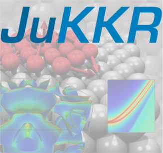

#########################################
`AiiDA`_ plugin for the `Jülich KKRcode`_
#########################################

.. image:: images/AiiDA_transparent_logo.png
    :width: 40%

Welcome to documentation of the AiiDA plugin for the `Jülich KKRcode`_!
===========================================================================

The plugin is available at https://github.com/JuDFTteam/aiida-kkr

If you use this plugin for your research, please cite the following work:

.. highlights:: Philipp Rüßmann, Fabian Bertoldo, and Stefan Blügel,
  *The AiiDA-KKR plugin and its application to high-throughput impurity embedding into a topological insulator*.
  npj Comput Mater **7**, 13 (2021); `DOI 10.1038/s41524-020-00482-5`_

Also please cite the `AiiDA`_ papers:

.. highlights:: Sebastiaan P. Huber, Spyros Zoupanos, Martin Uhrin, Leopold Talirz, Leonid Kahle, Rico Häuselmann,
  Dominik Gresch, Tiziano Müller, Aliaksandr V. Yakutovich, Casper W. Andersen, Francisco F. Ramirez, Carl S. Adorf,
  Fernando Gargiulo, Snehal Kumbhar, Elsa Passaro, Conrad Johnston, Andrius Merkys, Andrea Cepellotti, Nicolas Mounet,
  Nicola Marzari, Boris Kozinsky, and Giovanni Pizzi,
  *AiiDA 1.0, a scalable computational infrastructure for automated reproducible workflows and data provenance*,
  Scientific Data **7**, 300 (2020); `DOI: 10.1038/s41597-020-00638-4`_

and

.. highlights:: Martin Uhrin, Sebastiaan. P. Huber, Jusong Yu, Nicola Marzari, and Giovanni Pizzi,
  *Workflows in AiiDA: Engineering a high-throughput, event-based engine for robust and modular computational workflows*,
  Computational Materials Science **187**, 110086 (2021); `DOI: 10.1016/j.commatsci.2020.110086`_

or if you are using AiiDA<1.0:

.. highlights:: Giovanni Pizzi, Andrea Cepellotti, Riccardo Sabatini, Nicola Marzari, and Boris Kozinsky,
  *AiiDA: automated interactive infrastructure and database for computational science*,
  Comp. Mat. Sci **111**, 218-230 (2016); `DOI: 10.1016/j.commatsci.2015.09.013`_

Requirements
------------

- Installation of `aiida-core`_
- Installation of KKR codes (*kkrhost*, *kkrimp*, *voronoi*) of the `JuKKR package`_
- Installation of `aiida-kkr`_

Once all requirements are installed you need to `set up the computers and codes`_ before you can submit KKR calcutions using the *aiida-kkr* plugin.

.. toctree::
   :maxdepth: 2

   user_guide/index
   developer_guide/index
   API documentation <module_guide/index>

Indices and tables
==================

* :ref:`genindex`
* :ref:`modindex`
* :ref:`search`

.. _AiiDA: http://www.aiida.net
.. _Jülich KKRcode: http://jukkr.fz-juelich.de
.. _juDFT: http://www.judft.de/pm/index.php
.. _`aiida-core`: https://aiida-core.readthedocs.io/en/stable/installation/index.html
.. _`aiida-kkr`: https://github.com/JuDFTteam/aiida-kkr/blob/master/README.md
.. _`JuKKR package`: https://iffgit.fz-juelich.de/kkr/jukkr
.. _`set up the computers and codes`: https://aiida-core.readthedocs.io/en/stable/get_started/index.html#setup-of-computers-and-codes
.. _`DOI: 10.1038/s41597-020-00638-4`: https://doi.org/10.1038/s41597-020-00638-4
.. _`DOI: 10.1016/j.commatsci.2020.110086`: https://doi.org/10.1016/j.commatsci.2020.110086
.. _`DOI: 10.1016/j.commatsci.2015.09.013`: https://doi.org/10.1016/j.commatsci.2015.09.013
.. _`DOI 10.1038/s41524-020-00482-5`: https://doi.org/10.1038/s41524-020-00482-5
