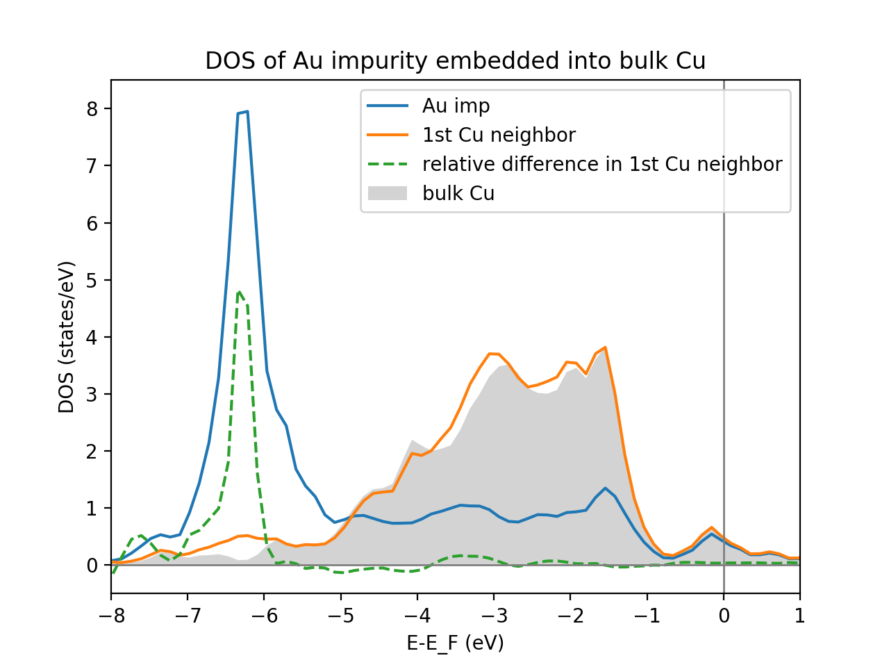

===============
Calculations
===============

Here the calculations of the aiida-kkr plugin are presented. It is assumed that  the user already has
basic knowledge of python, aiida (e.g. database structure, verdi commands, structure nodes) and
KKR (e.g. LMAX cutoff, energy contour integration). Also *aiida-kkr* should be installed as well as
the Voronoi, KKR and KKRimp codes should already be configured.
    
In the following the calculation plugins provided by aiida-kkr are introduced at the
example of bulk Cu.

.. note::
          If you follow the steps described here please make sure that your python script contains::
          
             from aiida import load_dbenv, is_dbenv_loaded
             if not is_dbenv_loaded():
                 load_dbenv()
                 
          To ensure that the aiida database is properly integrated.
    

Voronoi starting potential generator
++++++++++++++++++++++++++++++++++++

The Voronoi code creates starting potentials for a KKR calculation and sets up 
the atom-centered division of space into voronoi cells. Also corresponding shape 
functions are created, which are needed for full-potential corrections.

The voronoi plugin is called ``kkr.voro`` and it has the following input and output nodes:

Three input nodes:
    * ``parameters`` KKR parameter set for Voronoi calculation (ParameterData)
    * ``structure`` structure data node node describing the crystal lattice (StructureData)
    * ``code`` Voronoi code node (code)

Three output nodes:
    * ``remote_folder`` (RemoteData)
    * ``retrieved`` (FolderData)
    * ``output_parameters`` (ParameterData)

Now the basic usage of the voronoi plugin is demonstrated at the example of Cu bulk 
for which first the aiida structure node and the parameter node containing 
KKR specific parameters (LMAX cutoff etc.) are created before a voronoi calculation 
is set up and submitted.

    
Input structure node
--------------------

First we create an aiida structure::
    
    # get aiida StructureData class:
    from aiida.orm import DataFactory
    StructureData = DataFactory('structure')

Then we create the aiida StructureData node (here for bulk Cu)::
    
    alat = 3.61 # lattice constant in Angstroem
    bravais = [[0.5*alat, 0.5*alat, 0], [0.5*alat, 0, 0.5*alat], [0, 0.5*alat, 0.5*alat]] # Bravais matrix in Ang. units
    # now create StructureData instance and set Bravais matrix and atom in unit cell
    Cu = StructureData(cell=bravais)
    Cu.append_atom(position=[0,0,0], symbols='Cu')

    
Input parameter node
--------------------
    
Next we create an empty set of KKR parameters (LMAX cutoff etc. ) for voronoi code::

    # load kkrparms class which is a useful tool to create the set of input parameters for KKR-family of calculations
    from aiida_kkr.tools.kkr_params import kkrparams
    params = kkrparams(params_type='voronoi')
    
.. note:: we can find out which parameters are mandatory to be set using 
          ``missing_params = params.get_missing_keys(use_aiida=True)``
and set at least the mandatory parameters::

    params.set_multiple_values(LMAX=2, NSPIN=1, RCLUSTZ=2.3)
    
finally create an aiida ParameterData node and fill with the dictionary of parameters::

    ParameterData = DataFactory('parameter') # use DataFactory to get ParamerterData class
    ParaNode = ParameterData(dict=params.get_dict())

    
Submit calculation
------------------

Now we get the voronoi code::

    from aiida.orm import Code # load aiida 'Code' class
    
    codename = 'voronoi@my_mac'
    code = Code.get_from_string(codename)

and create new instance of a VoronoiCalculation::

    voro_calc = code.new_calc()

and set resources that will be used (here serial job)::

    voro_calc.set_resources({'num_machines':1, 'tot_num_mpiprocs':1})

then set structure and input parameter::

    voro_calc.use_structure(Cu)
    voro_calc.use_parameters(ParaNode)
    
.. note:: If you use a computer without a default queue you need to set the name of the queue as well:
    ``voro_calc.set_queue_name('th1')``

Now we are ready to submit the calculation. For that we first need to store the 
input nodes nodes and then submit the calculation::

    voro_calc.store_all()
    voro_calc.submit()

.. note:: check calculation state (or use verdi calculation list -a -p1) using 
          ``voro_calc.get_state()``
    

KKR calculation for bulk and interfaces
+++++++++++++++++++++++++++++++++++++++

A KKR calculation is provided by the ``kkr.kkr`` plugin, which has the following 
input and output nodes.

Three input nodes:
    * ``parameters`` KKR parameter fitting the requirements for a KKR calculation (ParameterData)
    * ``parent_folder`` parent calulation remote folder node (RemoteFolder)
    * ``code`` KKR code node (code)

Three output nodes:
    * ``remote_folder`` (RemoteData)
    * ``retrieved`` (FolderData)
    * ``output_parameters`` (ParameterData)
    
.. note:: The parent calculation can be one of the following:

             #. Voronoi calculation, initial calculation starting from structure
             #. previous KKR calculation, e.g. preconverged calculation
          The necessary structure information is always extracted from the voronoi parent calculation. 
          In case of a continued calculation the voronoi parent is recuresively searched for.
          
Special features exist where a fourth input node is persent and which triggers special behavior of the KKR calculation:
    * ``impurity_info`` Node specifying the impurity cluster (ParameterData)

The different possible modes to run a kkr calculation (start from Voronoi calculation,
continue from previous KKR calculation, *host Greenfunction writeout* feature) are demonstrated in the following.
    
                                                       
Start KKR calculation from voronoi parent
-----------------------------------------

Reuse settings from voronoi calculation::

    voronoi_calc_folder = voro_calc.out.remote_folder
    voro_params = voro_calc.inp.parameters

    
Now we update the KKR parameter set to meet the requirements for a KKR calculation
(slightly different than voronoi calculation). Thus, we create a new set of parameters 
for a KKR calculation and fill the already set values from the previous voronoin calculation::

    # new kkrparams instance for KKR calculation
    params = kkrparams(params_type='kkr', **voro_params.get_dict())
    
    # set the missing values
    params.set_multiple_values(RMAX=7., GMAX=65.)
    
    # choose 20 simple mixing iterations first to preconverge potential (here 5% simple mixing)
    params.set_multiple_values(NSTEPS=20, IMIX=0, STRMIX=0.05)
    
    # create aiida ParameterData node from the KKR parameters
    ParaNode = ParameterData(dict=params.get_dict())

.. note:: You can find out which parameters are missing for the KKR calculation using ``params.get_missing_keys()``

Now we can get the KKR code and create a new calculation instance and set the input nodes accordingly::

    code = Code.get_from_string('KKRcode@my_mac')
    kkr_calc = code.new_calc()
    
    # set input Parameter, parent calulation (previous voronoi calculation), computer resources 
    kkr_calc.use_parameters(ParaNode)
    kkr_calc.use_parent_folder(voronoi_calc_folder)
    kkr_calc.set_resources({'num_machines': 1, 'num_mpiprocs_per_machine':1})

We can then run the KKR calculation by again storing the input nodes and submit the calculation::

    kkr_calc.store_all()
    kkr_calc.submit()
        

.. _KKR_KKR_scf:

Continue KKR calculation from KKR parent calculation
----------------------------------------------------

create new KKR calculation instance to continue KKR ontop of a previous KKR calclation::

    kkr_calc_continued = code.new_calc()

reuse old KKR parameters and update scf settings (default is NSTEPS=1, IMIX=0)::

    params.set_multiple_values(NSTEPS=50, IMIX=5)

and create aiida ParameterData node::

    ParaNode = ParameterData(dict=params.get_dict())

then set input nodes for calculation::

    kkr_calc_continued.use_code(code)
    kkr_calc_continued.use_parameters(ParaNode)
    kkr_calc_parent_folder = kkr_calc.out.remote_folder # parent remote folder of previous calculation
    kkr_calc_continued.use_parent_folder(kkr_calc_parent_folder)
    kkr_calc_continued.set_resources({'num_machines': 1, 'num_mpiprocs_per_machine':1})

store input nodes and submit calculation::

    kkr_calc_continued.store_all()
    kkr_calc_continued.submit()
    
The finished calculation should have this output node that can be access within 
python using ``kkr_calc_continued.out.output_parameters.get_dict()``. An excerpt 
of the ouput dictionary may look like this::

    {u'alat_internal': 4.82381975,
     u'alat_internal_unit': u'a_Bohr',
     u'convergence_group': {
         u'calculation_converged': True,
         u'charge_neutrality': -1.1e-05,
         u'nsteps_exhausted': False,
         u'number_of_iterations': 47,
         u'rms': 6.4012e-08,
         ...},
    u'energy': -44965.5181266111,
    u'energy_unit': u'eV',
    u'fermi_energy': 0.6285993399,
    u'fermi_energy_units': u'Ry',
    u'nspin': 1,
    u'number_of_atoms_in_unit_cell': 1,
    u'parser_errors': [],
    ...
    u'warnings_group': {u'number_of_warnings': 0, u'warnings_list': []}}

.. _host_GF_writeout:
    
Special run modes (additional input nodes)
------------------------------------------

Writeout host Green function (for KKRimp calculation)
Create impurity_info node, 

Here we take the remote folder of the converged calculation to reuse settings and write out Green function and tmat of the crystalline host system::

    kkr_converged_parent_folder = kkr_calc_continued.out.remote_folder

Now we cal extract the parameters of the kkr calculation and add the ``KKRFLEX`` run-option::

    kkrcalc_converged = kkr_converged_parent_folder.get_inputs()[0]
    kkr_params_dict = kkrcalc_converged.inp.parameters.get_dict()
    kkr_params_dict['RUNOPT'] = ['KKRFLEX']
    
The parameters dictionary is not passed to the aiida ParameterData node::

    ParaNode = ParameterData(dict=kkr_params_dict)
    
Now we create a new KKR calculation and set input nodes::

    code = kkrcalc_converged.get_code() # take the same code as in the calculation before
    GF_host_calc= code.new_calc()
    resources = kkrcalc_converged.get_resources()
    GF_host_calc.set_resources(resources)
    GF_host_calc.use_parameters(ParaNode)
    GF_host_calc.use_parent_folder(kkr_converged_parent_folder)
    # prepare impurity_info node containing the information about the impurity cluster
    imp_info = ParameterData(dict={'Rcut':1.01, 'ilayer_center': 0, 'Zimp':[79.]})
    # set impurity info node to calculation
    GF_host_calc.use_impurity_info(imp_info)
    
.. note:: The ``impurity_info`` node should be a ParameterData node and its dictionary should describe 
    the impurity cluster using the following parameters:
    
        * ``ilayer_center`` (int) layer index of position in the unit cell that describes the center of the impurity cluster 
        * ``Rcut`` (float) cluster radius of impurity cluster in units of the lattice constant
        * ``hcut`` (float, *optional*) height of a cylindrical cluster with radius ``Rcut``, if not given spherical cluster is taken
        * ``cylinder_orient`` (list of 3 float values, *optional*)
        * ``Zimp`` (list of *Nimp* float entries) atomic charges of the substitutional impurities on positions defined by ``Rimp_rel``
        * ``Rimp_rel`` (list of *Nimp* [float, float, float] entries, *optional*, defaults to [0,0,0] for single impurity) cartesian positions of all *Nimp* impurities, relative to the center of cluster (i.e. position defined by ``ilayer_center``)
        * ``imp_cls`` (list of [float, float, float, int] entries, *optional*) full list of impurity cluster positions and layer indices *(x, y, z, ilayer)*, overwrites auto generation using ``Rcut`` and ``hcut`` settings
                       
        .. warning:: ``imp_cls`` functionality not implemented yet
            
    
The calculation can then be submitted::

    # store input nodes and submit calculation
    GF_host_calc.store_all()
    GF_host_calc.submit()

Once the calculation has finished the retrieve folder should contain the ``kkrflex_*`` files needed for the impurity calculation.

KKR impurity calculation
++++++++++++++++++++++++

Plugin: ``kkr.kkrimp``

Four input nodes:
    * ``parameters``, optional: KKR parameter fitting the requirements for a KKRimp calculation (ParameterData)
    * Only one of
    
        #. ``impurity_potential``: starting potential for the impurity run (SingleFileData)
        #. ``parent_folder``: previous KKRimp parent calulation folder (RemoteFolder)
    * ``code``: KKRimp code node (code)
    * ``host_Greenfunction_folder``: KKR parent calulation folder containing the writeout of the :ref:`host's Green function files <host_GF_writeout>` (RemoteFolder)
    
.. note:: If no ``parameters`` node is given then the default values are extracted from the ``host_Greenfunction`` calculation.

Three output nodes:
    * ``remote_folder`` (RemoteData)
    * ``retrieved`` (FolderData)
    * ``output_parameters`` (ParameterData)
    
.. note:: The parent calculation can be one of the following:

             #. Voronoi calculation, initial calculation starting from structure
             #. previous KKR calculation, e.g. preconverged calculation
          The necessary structure information is always extracted from the voronoi parent calculation. 
          In case of a continued calculation the voronoi parent is recuresively searched for.
          

Create impurity potential
-------------------------

Now the starting potential for the impurity calculation needs to be generated. 
This means that we need to create an auxiliary structure which contians the impurity 
in the system where we want to embed it. Then we run a Voronoi calculation to create 
the starting potential. Here we use the example of a Au impurity embedded into bulk Cu.

The impurity code expects an aiida SingleFileData object that contains the impurity 
potential. This is finally constructed using ``the neworder_potential_wf`` workfunction
from ``aiida_kkr.tools.common_workfunctions``.

We start with the creation of the auxiliary styructure::

    # use an aiida workfunction to keep track of the provenance
    from aiida.work import workfunction as wf
    @wf
    def change_struc_imp_aux_wf(struc, imp_info): # Note: works for single imp at center only!
        from aiida.common.constants import elements as PeriodicTableElements
        _atomic_numbers = {data['symbol']: num for num, data in PeriodicTableElements.iteritems()}
    
        new_struc = StructureData(cell=struc.cell)
        isite = 0
        for site in struc.sites:
            sname = site.kind_name
            kind = struc.get_kind(sname)
            pos = site.position
            zatom = _atomic_numbers[kind.get_symbols_string()]
            if isite == imp_info.get_dict().get('ilayer_center'):
                zatom = imp_info.get_dict().get('Zimp')[0]
            symbol = PeriodicTableElements.get(zatom).get('symbol')
            new_struc.append_atom(position=pos, symbols=symbol)
            isite += 1
            
        return new_struc

    new_struc = change_struc_imp_aux_wf(voro_calc.inp.structure, imp_info)
    
Then we run the Voronoi calculation for auxiliary structure to create the impurity starting potential::

    codename = 'voronoi@my_mac'
    code = Code.get_from_string(codename)
    
    voro_calc_aux = code.new_calc()
    voro_calc_aux.set_resources({'num_machines':1, 'tot_num_mpiprocs':1})
    voro_calc_aux.use_structure(new_struc)
    voro_calc_aux.use_parameters(kkrcalc_converged.inp.parameters)
    
    voro_calc_aux.store_all()
    voro_calc_aux.submit()
    
Now we create the impurity starting potential using the converged host potential 
for the surrounding of the impurity and the new Au impurity startpot::

    from aiida_kkr.tools.common_workfunctions import neworder_potential_wf

    potname_converged = kkrcalc_converged._POTENTIAL
    potname_imp = 'potential_imp'
    neworder_pot1 = [int(i) for i in loadtxt(GF_host_calc.out.retrieved.get_abs_path('scoef'), skiprows=1)[:,3]-1]
    potname_impvorostart = voro_calc_aux._OUT_POTENTIAL_voronoi
    replacelist_pot2 = [[0,0]]
    
    settings_dict = {'pot1': potname_converged,  'out_pot': potname_imp, 'neworder': neworder_pot1,
                     'pot2': potname_impvorostart, 'replace_newpos': replacelist_pot2, 'label': 'startpot_KKRimp',
                     'description': 'starting potential for Au impurity in bulk Cu'} 
    settings = ParameterData(dict=settings_dict)
    
    startpot_Au_imp_sfd = neworder_potential_wf(settings_node=settings, 
                                                parent_calc_folder=kkrcalc_converged.out.remote_folder, 
                                                parent_calc_folder2=voro_calc_aux.out.remote_folder)
    

Create and submit initial KKRimp calculation
--------------------------------------------

Now we create a new impurity calculation, set all input nodes and submit the calculation 
to preconverge the impurity potential (Au embedded into Cu ulk host as described in the 
``impurity_info`` node)::

    # needed to link to host GF writeout calculation
    GF_host_output_folder = GF_host_calc.out.remote_folder
    
    # create new KKRimp calculation
    from aiida_kkr.calculations.kkrimp import KkrimpCalculation
    kkrimp_calc = KkrimpCalculation()
    
    kkrimp_code = Code.get_from_string('KKRimp@my_mac')
    
    kkrimp_calc.use_code(kkrimp_code)
    kkrimp_calc.use_host_Greenfunction_folder(GF_host_output_folder)
    kkrimp_calc.use_impurity_potential(startpot_Au_imp_sfd)
    kkrimp_calc.set_resources(resources)
    kkrimp_calc.set_computer(kkrimp_code.get_computer())
    
    # first set 20 simple mixing steps
    kkrimp_params = kkrparams(params_type='kkrimp')
    kkrimp_params.set_multiple_values(SCFSTEPS=20, IMIX=0, MIXFAC=0.05)
    ParamsKKRimp = ParameterData(dict=kkrimp_params.get_dict())
    kkrimp_calc.use_parameters(ParamsKKRimp)
    
    # store and submit
    kkrimp_calc.store_all()
    kkrimp_calc.submit()

Restart KKRimp calculation from KKRimp parent
---------------------------------------------

Here we demonstrate how to restart a KKRimp calculation from a parent calculation 
from which the starting potential is extracted autimatically. This is used to compute 
the converged impurity potential starting from the previous preconvergence step::

    kkrimp_calc_converge = kkrimp_code.new_calc()
    kkrimp_calc_converge.use_parent_calc_folder(kkrimp_calc.out.remote_folder)
    kkrimp_calc_converge.set_resources(resources)
    kkrimp_calc_converge.use_host_Greenfunction_folder(kkrimp_calc.inp.GFhost_folder)
    
    kkrimp_params = kkrparams(params_type='kkrimp', **kkrimp_calc.inp.parameters.get_dict())
    kkrimp_params.set_multiple_values(SCFSTEPS=99, IMIX=5, MIXFAC=0.05)
    ParamsKKRimp = ParameterData(dict=kkrimp_params.get_dict())
    kkrimp_calc_converge.use_parameters(ParamsKKRimp)
    
    # store and submit
    kkrimp_calc_converge.store_all()
    kkrimp_calc_converge.submit()
    

Impurity DOS
------------

create final imp DOS (new host GF for DOS contour, then KKRimp calc using converged potential)

first prepare host GF with DOS contour::

    params = kkrparams(**GF_host_calc.inp.parameters.get_dict())
    params.set_multiple_values(EMIN=-0.2, EMAX=GF_host_calc.res.fermi_energy+0.1, NPOL=0, NPT1=0, NPT2=101, NPT3=0)
    ParaNode = ParameterData(dict=params.get_dict())
    
    code = GF_host_calc.get_code() # take the same code as in the calculation before
    GF_host_doscalc= code.new_calc()
    resources = GF_host_calc.get_resources()
    GF_host_doscalc.set_resources(resources)
    GF_host_doscalc.use_parameters(ParaNode)
    GF_host_doscalc.use_parent_folder(kkr_converged_parent_folder)
    GF_host_doscalc.use_impurity_info(GF_host_calc.inp.impurity_info)
    
    GF_host_doscalc.store_all()
    GF_host_doscalc.submit()
    
Then we run the KKRimp step using the converged potential (via the ``parent_calc_folder`` 
node) and the host GF which contains the DOS contour information (via ``host_Greenfunction_folder``)::

    kkrimp_doscalc = kkrimp_calc_converge.get_code().new_calc()
    kkrimp_doscalc.use_host_Greenfunction_folder(GF_host_doscalc.out.remote_folder)
    kkrimp_doscalc.use_parent_calc_folder(kkrimp_calc_converge.out.remote_folder)
    kkrimp_doscalc.set_resources(kkrimp_calc_converge.get_resources())
    
    params = kkrparams(params_type='kkrimp', **kkrimp_calc_converge.inp.parameters.get_dict())
    params.set_multiple_values(RUNFLAG=['lmdos'], SCFSTEPS=1)
    ParaNode = ParameterData(dict=params.get_dict())
    
    kkrimp_doscalc.use_parameters(ParaNode)
    
    kkrimp_doscalc.store_all()
    kkrimp_doscalc.submit()
    
Finally we plot the DOS::

    # get interpolated DOS from GF_host_doscalc calculation:
    from aiida_kkr.tools.common_functions import interpolate_dos
    dospath_host = GF_host_doscalc.out.retrieved.get_abs_path('')
    ef, dos, dos_interpol = interpolate_dos(dospath_host, return_original=True)
    dos, dos_interpol = dos[0], dos_interpol[0]
    
    # read in impurity DOS
    from numpy import loadtxt
    impdos0 = loadtxt(kkrimp_doscalc.out.retrieved.get_abs_path('out_lmdos.interpol.atom=01_spin1.dat'))
    impdos1 = loadtxt(kkrimp_doscalc.out.retrieved.get_abs_path('out_lmdos.interpol.atom=13_spin1.dat'))
    # sum over spins:
    impdos0[:,1:] = impdos0[:,1:]*2
    impdos1[:,1:] = impdos1[:,1:]*2
    
    # plot bulk and impurity DOS
    from matplotlib.pyplot import figure, fill_between, plot, legend, title, axhline, axvline, xlim, ylim, ylabel, xlabel, title, show
    figure()
    fill_between((dos_interpol[:,0]-ef)*13.6, dos_interpol[:,1]/13.6, color='lightgrey', lw=0, label='bulk Cu')
    plot((impdos0[:,0]-ef)*13.6, impdos0[:,1]/13.6, label='Au imp')
    plot((impdos0[:,0]-ef)*13.6, impdos1[:,1]/13.6, label='1st Cu neighbor')
    plot((impdos0[:,0]-ef)*13.6, (impdos1[:,1]-dos_interpol[:,1])/dos_interpol[:,1], '--', label='relative difference in 1st Cu neighbor')
    legend()
    title('DOS of Au impurity embedded into bulk Cu')
    axhline(0, lw=1, color='grey')
    axvline(0, lw=1, color='grey')
    xlim(-8, 1)
    ylim(-0.5,8.5)
    xlabel('E-E_F (eV)')
    ylabel('DOS (states/eV)')
    show()
    
Which should look like this:

    
KKR calculation importer
++++++++++++++++++++++++

Plugin ``kkr.kkrimporter`` 

The calculation importer can be used to import a already finished KKR calculation to the aiida dbatabase.
The KKRimporterCalculation takes the inputs

    * ``code``: KKR code installation on the computer from which the calculation is imported
    * ``computer``: computer on which the calulation has been performed
    * ``resources``: resources used in the calculation
    * ``remote_workdir``: remote abolute path on ``computer`` to the path where the calculation has been performed
    * ``input_file_names``: dictionary of input file names
    * ``output_file_names``, optional: dictionary of output file names

and mimicks a KKR calculation (i.e. stores KKR parameter set in node ``parameters`` and 
the extracted aiida StructureData node ``structure`` as inputs and creates 
``remote_folder``, ``retrieved`` and ``output_parameters`` output nodes). 
A KKRimporter calculation can then be used like a KKR claculation to continue 
calculations with correct provenance tracking in the database.

.. note:: At least ``input_file`` and ``potentail_file`` need to be given in ``input_file_names``.

Example on how to use the calculation importer::

    # Load the KKRimporter class
    from aiida.orm import CalculationFactory
    KkrImporter = CalculationFactory('kkr.kkrimporter')
    
    # Load the Code node representative of the one used to perform the calculations
    from aiida.orm.code import Code
    code = Code.get_from_string('KKRcode@my_mac')
    
    # Get the Computer node representative of the one the calculations were run on
    computer = code.get_remote_computer()
    
    # Define the computation resources used for the calculations
    resources = {'num_machines': 1, 'num_mpiprocs_per_machine': 1}
    
    # Create calculation
    calc1 = KkrImporter(computer=computer,
                        resources=resources,
                        remote_workdir='<absolute-remote-path-to-calculation>',
                        input_file_names={'input_file':'inputcard', 'potential_file':'potential', 'shapefun_file':'shapefun'},
                        output_file_names={'out_potential_file':'potential'})
    
    # Link the code that was used to run the calculations.
    calc1.use_code(code)
    
    # Get the computer's transport and create an instance.
    from aiida.backends.utils import get_authinfo, get_automatic_user
    authinfo = get_authinfo(computer=computer, aiidauser=get_automatic_user())
    transport = authinfo.get_transport()
    
    # Open the transport for the duration of the immigrations, so it's not
    # reopened for each one. This is best performed using the transport's
    # context guard through the ``with`` statement.
    with transport as open_transport:
        # Parse the calculations' input files to automatically generate and link the
        # calculations' input nodes.
        calc1.create_input_nodes(open_transport)
    
        # Store the calculations and their input nodes and tell the daeomon the output
        # is ready to be retrieved and parsed.
        calc1.prepare_for_retrieval_and_parsing(open_transport)

After the calculation has finished the following nodes should appear in the aiida database::
    
    $ verdi calculation show <pk-to-imported-calculation>
    -----------  ------------------------------------
    type         KkrImporterCalculation
    pk           22121
    uuid         848c2185-8c82-44cd-ab67-213c20aaa414
    label
    description
    ctime        2018-04-24 15:29:42.136154+00:00
    mtime        2018-04-24 15:29:48.496421+00:00
    computer     [1] my_mac
    code         KKRcode
    -----------  ------------------------------------
    ##### INPUTS:
    Link label       PK  Type
    ------------  -----  -------------
    parameters    22120  ParameterData
    structure     22119  StructureData
    ##### OUTPUTS:
    Link label            PK  Type
    -----------------  -----  -------------
    remote_folder      22122  RemoteData
    retrieved          22123  FolderData
    output_parameters  22124  ParameterData
    ##### LOGS:
    There are 1 log messages for this calculation
    Run 'verdi calculation logshow 22121' to see them

Example scripts
+++++++++++++++

Here is a small collection of example scripts.

Full example Voronoi-KKR-KKRimp
-------------------------------

Compact script starting with structure setup, then voronoi calculation, followed by 
initial KKR claculation which is then continued for convergence. The converged calculation 
is then used to write out the host GF and a simple inmpurity calculation is performed.

Download: :download:`this example script <../examples/kkr_short_example.py>`

::

    #!/usr/bin/env python
    
    # connect to aiida db
    from aiida import load_dbenv, is_dbenv_loaded
    if not is_dbenv_loaded():
        load_dbenv()
    # load essential aiida classes
    from aiida.orm import Code
    from aiida.orm import DataFactory
    StructureData = DataFactory('structure')
    ParameterData = DataFactory('parameter')
    
    # load kkrparms class which is a useful tool to create the set of input parameters for KKR-family of calculations
    from aiida_kkr.tools.kkr_params import kkrparams
    
    # load some python modules
    from numpy import array
    
    # helper function
    def wait_for_it(calc, maxwait=300):
        from time import sleep
        N = 0
        print 'start waiting for calculation to finish'
        while not calc.has_finished() and N<(maxwait/2.):
            N += 1
            if N%5==0:
                print('.')
            sleep(2.)
        print('waiting done after {} seconds: {} {}'.format(N*2, calc.has_finished(), calc.has_finished_ok()))
    
    
    ###################################################
    # initial structure
    ###################################################
    
    # create Copper bulk aiida Structure
    alat = 3.61 # lattice constant in Angstroem
    bravais = alat*array([[0.5, 0.5, 0], [0.5, 0, 0.5], [0, 0.5, 0.5]]) # Bravais matrix in Ang. units
    Cu = StructureData(cell=bravais)
    Cu.append_atom(position=[0,0,0], symbols='Cu')
    
    
    ###################################################
    # Voronoi step (preparation of starting potential)
    ###################################################
    
    # create empty set of KKR parameters (LMAX cutoff etc. ) for voronoi code
    params = kkrparams(params_type='voronoi')
    
    # and set at least the mandatory parameters
    params.set_multiple_values(LMAX=2, NSPIN=1, RCLUSTZ=2.3)
    
    # finally create an aiida ParameterData node and fill with the dictionary of parameters
    ParaNode = ParameterData(dict=params.get_dict())
    
    # choose a valid installation of the voronoi code
    ### !!! adapt to your code name !!! ###
    codename = 'voronoi@my_mac'
    code = Code.get_from_string(codename)
    
    # create new instance of a VoronoiCalculation
    voro_calc = code.new_calc()
    
    # and set resources that will be used (here serial job)
    voro_calc.set_resources({'num_machines':1, 'tot_num_mpiprocs':1})
    
    ### !!! use queue name if necessary !!! ###
    # voro_calc.set_queue_name('<quene_name>')
    
    # then set structure and input parameter
    voro_calc.use_structure(Cu)
    voro_calc.use_parameters(ParaNode)
    
    # store all nodes and submit the calculation
    voro_calc.store_all()
    voro_calc.submit()
    
    wait_for_it(voro_calc)
    
    # for future reference
    voronoi_calc_folder = voro_calc.out.remote_folder
    voro_params = voro_calc.inp.parameters
    
    
    ###################################################
    # KKR step (20 iterations simple mixing)
    ###################################################
    
    # create new set of parameters for a KKR calculation and fill with values from previous voronoin calculation
    params = kkrparams(params_type='kkr', **voro_params.get_dict())
    
    # and set the missing values
    params.set_multiple_values(RMAX=7., GMAX=65.)
    
    # choose 20 simple mixing iterations first to preconverge potential (here 5% simple mixing)
    params.set_multiple_values(NSTEPS=20, IMIX=0, STRMIX=0.05)
    
    # create aiida ParameterData node from the KKR parameters
    ParaNode = ParameterData(dict=params.get_dict())
    
    # get KKR code and create new calculation instance
    ### !!! use your code name !!! ###
    code = Code.get_from_string('KKRcode@my_mac')
    kkr_calc = code.new_calc()
    
    # set input Parameter, parent calulation (previous voronoi calculation), computer resources
    kkr_calc.use_parameters(ParaNode)
    kkr_calc.use_parent_folder(voronoi_calc_folder)
    kkr_calc.set_resources({'num_machines': 1, 'num_mpiprocs_per_machine':1})
    
    ### !!! use queue name if necessary !!! ###
    # kkr_calc.set_queue_name('<quene_name>')
    
    # store nodes and submit calculation
    kkr_calc.store_all()
    kkr_calc.submit()
    
    # wait for calculation to finish
    wait_for_it(kkr_calc)
    
    
    ###################################################
    # 2nd KKR step (continued from previous KKR calc)
    ###################################################
    
    # create new KKR calculation instance to continue KKR ontop of a previous KKR calclation
    kkr_calc_continued = code.new_calc()
    
    # reuse old KKR parameters and update scf settings (default is NSTEPS=1, IMIX=0)
    params.set_multiple_values(NSTEPS=50, IMIX=5)
    # and create aiida ParameterData node
    ParaNode = ParameterData(dict=params.get_dict())
    
    # then set input nodes for calculation
    kkr_calc_continued.use_code(code)
    kkr_calc_continued.use_parameters(ParaNode)
    kkr_calc_parent_folder = kkr_calc.out.remote_folder # parent remote folder of previous calculation
    kkr_calc_continued.use_parent_folder(kkr_calc_parent_folder)
    kkr_calc_continued.set_resources({'num_machines': 1, 'num_mpiprocs_per_machine':1})
    
    ### !!! use queue name if necessary !!! ###
    # kkr_calc_continued.set_queue_name('<quene_name>')
    
    # store input nodes and submit calculation
    kkr_calc_continued.store_all()
    kkr_calc_continued.submit()
    
    # wait for calculation to finish
    wait_for_it(kkr_calc_continued)
    
    
    ###################################################
    # writeout host GF (using converged calculation)
    ###################################################
    
    # take remote folder of converged calculation to reuse setting and write out Green function and tmat of the crystalline host system
    kkr_converged_parent_folder = kkr_calc_continued.out.remote_folder
    
    # extreact kkr calculation from parent calculation folder
    kkrcalc_converged = kkr_converged_parent_folder.get_inputs()[0]
    
    # extract parameters from parent calculation and update RUNOPT for KKRFLEX option
    kkr_params_dict = kkrcalc_converged.inp.parameters.get_dict()
    kkr_params_dict['RUNOPT'] = ['KKRFLEX']
    
    # create aiida ParameterData node with set parameters that are updated compared to converged parent kkr calculation
    ParaNode = ParameterData(dict=kkr_params_dict)
    
    # create new KKR calculation
    code = kkrcalc_converged.get_code() # take the same code as in the calculation before
    GF_host_calc= code.new_calc()
    
    # set resources, Parameter Node and parent calculation
    resources = kkrcalc_converged.get_resources()
    GF_host_calc.set_resources(resources)
    GF_host_calc.use_parameters(ParaNode)
    GF_host_calc.use_parent_folder(kkr_converged_parent_folder)
    
    ### !!! use queue name if necessary !!! ###
    # GF_host_calc.set_queue_name('<quene_name>')
    
    # prepare impurity_info node containing the information about the impurity cluster
    imp_info = ParameterData(dict={'Rcut':1.01, 'ilayer_center':0, 'Zimp':[79.]})
    # set impurity info node to calculation
    GF_host_calc.use_impurity_info(imp_info)
    
    # store input nodes and submit calculation
    GF_host_calc.store_all()
    GF_host_calc.submit()
    
    # wait for calculation to finish
    wait_for_it(GF_host_calc)
    
    
    ######################################################################
    # KKRimp calculation (20 simple mixing iterations  for preconvergence)
    ######################################################################
    
    # first create impurity start pot using auxiliary voronoi calculation
    
    # creation of the auxiliary styructure:
    # use an aiida workfunction to keep track of the provenance
    from aiida.work import workfunction as wf
    @wf
    def change_struc_imp_aux_wf(struc, imp_info): # Note: works for single imp at center only!
        from aiida.common.constants import elements as PeriodicTableElements
        _atomic_numbers = {data['symbol']: num for num, data in PeriodicTableElements.iteritems()}
    
        new_struc = StructureData(cell=struc.cell)
        isite = 0
        for site in struc.sites:
            sname = site.kind_name
            kind = struc.get_kind(sname)
            pos = site.position
            zatom = _atomic_numbers[kind.get_symbols_string()]
            if isite == imp_info.get_dict().get('ilayer_center'):
                zatom = imp_info.get_dict().get('Zimp')[0]
            symbol = PeriodicTableElements.get(zatom).get('symbol')
            new_struc.append_atom(position=pos, symbols=symbol)
            isite += 1
    
        return new_struc
    
    new_struc = change_struc_imp_aux_wf(voro_calc.inp.structure, imp_info)
    
    # then Voronoi calculation for auxiliary structure
    ### !!! use your code name !!! ###
    codename = 'voronoi@my_mac'
    code = Code.get_from_string(codename)
    voro_calc_aux = code.new_calc()
    voro_calc_aux.set_resources({'num_machines':1, 'tot_num_mpiprocs':1})
    voro_calc_aux.use_structure(new_struc)
    voro_calc_aux.use_parameters(kkrcalc_converged.inp.parameters)
    voro_calc_aux.store_all()
    voro_calc_aux.submit()
    ### !!! use queue name if necessary !!! ###
    # voro_calc_aux.set_queue_name('<quene_name>')
    
    # wait for calculation to finish
    wait_for_it(voro_calc_aux)
    
    # then create impurity startpot using auxiliary voronoi calc and converged host potential
    
    from aiida_kkr.tools.common_workfunctions import neworder_potential_wf
    
    potname_converged = kkrcalc_converged._POTENTIAL
    potname_imp = 'potential_imp'
    neworder_pot1 = [int(i) for i in loadtxt(GF_host_calc.out.retrieved.get_abs_path('scoef'), skiprows=1)[:,3]-1]
    potname_impvorostart = voro_calc_aux._OUT_POTENTIAL_voronoi
    replacelist_pot2 = [[0,0]]
    
    settings_dict = {'pot1': potname_converged,  'out_pot': potname_imp, 'neworder': neworder_pot1,
                     'pot2': potname_impvorostart, 'replace_newpos': replacelist_pot2, 'label': 'startpot_KKRimp',
                     'description': 'starting potential for Au impurity in bulk Cu'}
    settings = ParameterData(dict=settings_dict)
    
    startpot_Au_imp_sfd = neworder_potential_wf(settings_node=settings,
                                                parent_calc_folder=kkrcalc_converged.out.remote_folder,
                                                parent_calc_folder2=voro_calc_aux.out.remote_folder)
    
    # now create KKRimp calculation and run first (some simple mixing steps) calculation
    
    # needed to link to host GF writeout calculation
    GF_host_output_folder = GF_host_calc.out.remote_folder
    
    # create new KKRimp calculation
    from aiida_kkr.calculations.kkrimp import KkrimpCalculation
    kkrimp_calc = KkrimpCalculation()
    
    ### !!! use your code name !!! ###
    kkrimp_code = Code.get_from_string('KKRimp@my_mac')
    
    kkrimp_calc.use_code(kkrimp_code)
    kkrimp_calc.use_host_Greenfunction_folder(GF_host_output_folder)
    kkrimp_calc.use_impurity_potential(startpot_Au_imp_sfd)
    kkrimp_calc.set_resources(resources)
    kkrimp_calc.set_computer(kkrimp_code.get_computer())
    
    # first set 20 simple mixing steps
    kkrimp_params = kkrparams(params_type='kkrimp')
    kkrimp_params.set_multiple_values(SCFSTEPS=20, IMIX=0, MIXFAC=0.05)
    ParamsKKRimp = ParameterData(dict=kkrimp_params.get_dict())
    kkrimp_calc.use_parameters(ParamsKKRimp)
    
    # store and submit
    kkrimp_calc.store_all()
    kkrimp_calc.submit()
    
    # wait for calculation to finish
    wait_for_it(kkrimp_calc)
    
    
    ###################################################
    # continued KKRimp calculation until convergence
    ###################################################
    
    kkrimp_calc_converge = kkrimp_code.new_calc()
    kkrimp_calc_converge.use_parent_calc_folder(kkrimp_calc.out.remote_folder)
    kkrimp_calc_converge.set_resources(resources)
    kkrimp_calc_converge.use_host_Greenfunction_folder(kkrimp_calc.inp.GFhost_folder)
    
    kkrimp_params = kkrparams(params_type='kkrimp', **kkrimp_calc.inp.parameters.get_dict())
    kkrimp_params.set_multiple_values(SCFSTEPS=99, IMIX=5, MIXFAC=0.05)
    ParamsKKRimp = ParameterData(dict=kkrimp_params.get_dict())
    kkrimp_calc_converge.use_parameters(ParamsKKRimp)
    
    ### !!! use queue name if necessary !!! ###
    # kkrimp_calc_converge.set_queue_name('<quene_name>')
    
    # store and submit
    kkrimp_calc_converge.store_all()
    kkrimp_calc_converge.submit()
    
    wait_for_it(kkrimp_calc_converge)
    
    
KKRimp DOS (starting from converged parent KKRimp calculation)
--------------------------------------------------------------

Script running host GF step for DOS contour first before running KKRimp step and plotting.

Download: :download:`this example script <../examples/kkrimp_dos_example.py>`

::

    #!/usr/bin/env python
    
    # connect to aiida db
    from aiida import load_dbenv, is_dbenv_loaded
    if not is_dbenv_loaded():
        load_dbenv()
    # load essential aiida classes
    from aiida.orm import DataFactory, load_node
    ParameterData = DataFactory('parameter')
    

    # some settings:
    #DOS contour (in Ry units), emax=EF+dE_emax:
    emin, dE_emax, npt = -0.2, 0.1, 101
    # kkrimp parent (converged imp pot, needs to tbe a KKRimp calculation node)
    kkrimp_calc_converge = load_node(25025)
    
    # derived quantities:
    GF_host_calc = kkrimp_calc_converge.inp.GFhost_folder.inp.remote_folder
    kkr_converged_parent_folder = GF_host_calc.inp.parent_calc_folder
    
    # helper function
    def wait_for_it(calc, maxwait=300):
        from time import sleep
        N = 0
        print 'start waiting for calculation to finish'
        while not calc.has_finished() and N<(maxwait/2.):
            N += 1
            if N%5==0:
                print('.')
            sleep(2.)
        print('waiting done after {} seconds: {} {}'.format(N*2, calc.has_finished(), calc.has_finished_ok()))
    
    ################################################################################################
    
    # first host GF with DOS contour
    from aiida_kkr.tools.kkr_params import kkrparams
    params = kkrparams(**GF_host_calc.inp.parameters.get_dict())
    params.set_multiple_values(EMIN=emin, EMAX=GF_host_calc.res.fermi_energy+dE_emax, NPOL=0, NPT1=0, NPT2=npt, NPT3=0)
    ParaNode = ParameterData(dict=params.get_dict())
    
    code = GF_host_calc.get_code() # take the same code as in the calculation before
    GF_host_doscalc= code.new_calc()
    resources = GF_host_calc.get_resources()
    GF_host_doscalc.set_resources(resources)
    GF_host_doscalc.use_parameters(ParaNode)
    GF_host_doscalc.use_parent_folder(kkr_converged_parent_folder)
    GF_host_doscalc.use_impurity_info(GF_host_calc.inp.impurity_info)
    
    # store and submit
    GF_host_doscalc.store_all()
    GF_host_doscalc.submit()
    
    # wait for calculation to finish
    print 'host GF calc for DOS contour'
    wait_for_it(GF_host_doscalc)
    
    # then KKRimp step using the converged potential
    
    kkrimp_doscalc = kkrimp_calc_converge.get_code().new_calc()
    kkrimp_doscalc.use_host_Greenfunction_folder(GF_host_doscalc.out.remote_folder)
    kkrimp_doscalc.use_parent_calc_folder(kkrimp_calc_converge.out.remote_folder)
    kkrimp_doscalc.set_resources(kkrimp_calc_converge.get_resources())
    
    # set to DOS settings
    params = kkrparams(params_type='kkrimp', **kkrimp_calc_converge.inp.parameters.get_dict())
    params.set_multiple_values(RUNFLAG=['lmdos'], SCFSTEPS=1)
    ParaNode = ParameterData(dict=params.get_dict())
    
    kkrimp_doscalc.use_parameters(ParaNode)
    
    # store and submit calculation
    kkrimp_doscalc.store_all()
    kkrimp_doscalc.submit()
    
    # wait for calculation to finish
    
    print 'KKRimp calc DOS'
    wait_for_it(kkrimp_doscalc)
    
    # Finally plot the DOS:
    
    # get interpolated DOS from GF_host_doscalc calculation:
    from aiida_kkr.tools.common_functions import interpolate_dos
    dospath_host = GF_host_doscalc.out.retrieved.get_abs_path('')
    ef, dos, dos_interpol = interpolate_dos(dospath_host, return_original=True)
    dos, dos_interpol = dos[0], dos_interpol[0]
    
    # read in impurity DOS
    from numpy import loadtxt
    impdos0 = loadtxt(kkrimp_doscalc.out.retrieved.get_abs_path('out_lmdos.interpol.atom=01_spin1.dat'))
    impdos1 = loadtxt(kkrimp_doscalc.out.retrieved.get_abs_path('out_lmdos.interpol.atom=13_spin1.dat'))
    # sum over spins:
    impdos0[:,1:] = impdos0[:,1:]*2
    impdos1[:,1:] = impdos1[:,1:]*2
    
    # plot bulk and impurity DOS
    from matplotlib.pyplot import figure, fill_between, plot, legend, title, axhline, axvline, xlim, ylim, ylabel, xlabel, title, show
    figure()
    fill_between((dos_interpol[:,0]-ef)*13.6, dos_interpol[:,1]/13.6, color='lightgrey', lw=0, label='bulk Cu')
    plot((impdos0[:,0]-ef)*13.6, impdos0[:,1]/13.6, label='Au imp')
    plot((impdos0[:,0]-ef)*13.6, impdos1[:,1]/13.6, label='1st Cu neighbor')
    plot((impdos0[:,0]-ef)*13.6, (impdos1[:,1]-dos_interpol[:,1])/dos_interpol[:,1], '--', label='relative difference in 1st Cu neighbor')
    legend()
    title('DOS of Au impurity embedded into bulk Cu')
    axhline(0, lw=1, color='grey')
    axvline(0, lw=1, color='grey')
    xlim(-8, 1)
    ylim(-0.5,8.5)
    xlabel('E-E_F (eV)')
    ylabel('DOS (states/eV)')
    show()