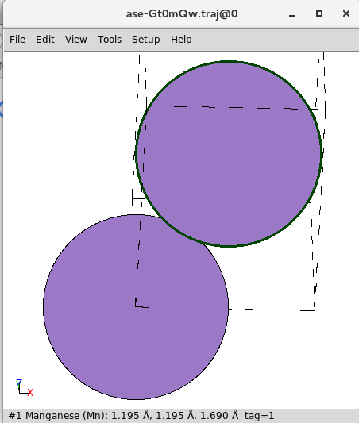
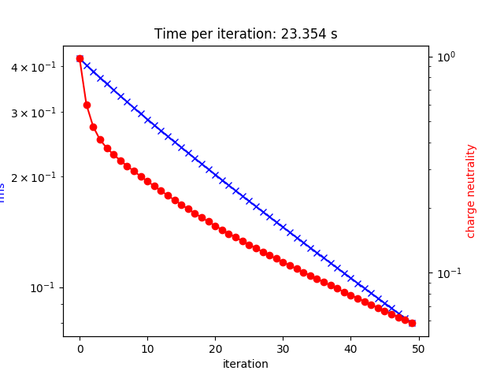
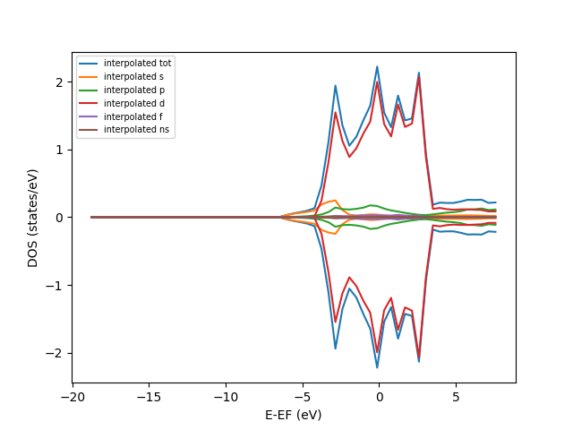
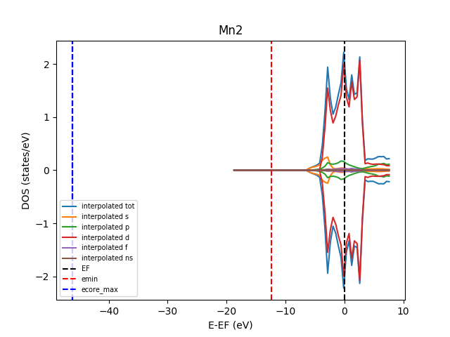
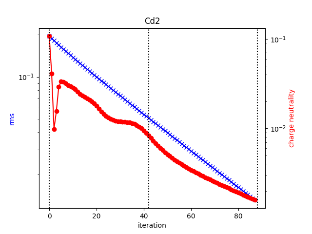
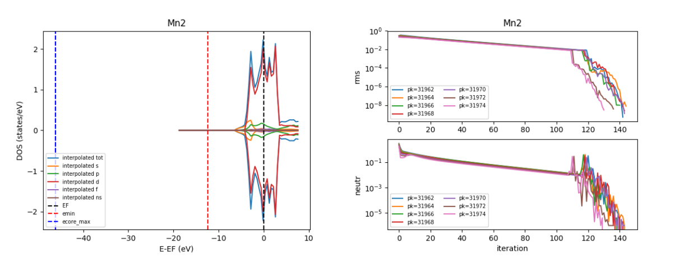
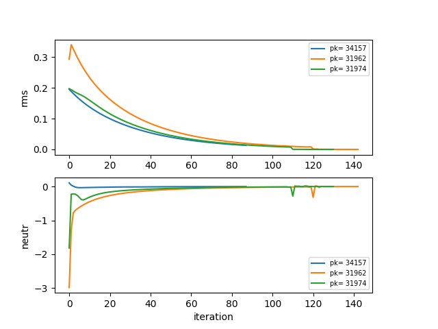

=====
Tools
=====

Here the tools provided by ``aiida-kkr`` are described.

Plotting tools
++++++++++++++

Visualize typical nodes using ``plot_kkr`` from ``aiida_kkr.tools.plot_kkr``. The ``plot_kkr`` function takes a node reference (can be a pk, uuid or the node itself or a list of these) and creates common plots for a quick visualization of the results obtained with the ``aiida-kkr`` plugin.

Usage example::

   from aiida_kkr.tools.plot_kkr import plot_kkr
   # use pk:
   plot_kkr(999999)
   # use uuid:
   plot_kkr('xxxxx-xxxxx')
   # used actual aiida node:
   from aiida.orm import load_node
   plot_kkr(load_node(999999))
   # give list of nodes which goups plots together
   plot_kkr([999999, 999998, 'xxxx-xxxxx', load_node(999999)])

The behavior of ``plot_kkr`` can be controled using keyword arguments::

   plot_kkr(99999, strucplot=False) # do not call ase`s view function to visualize structure
   plot_kkr(99999, silent=True) # plots only (no printout of inputs/outputs to node)

List of ``plot_kkr`` specific keyword arguments:

   * ``silent`` (*bool*, default: ``False``): print information about input node including inputs and outputs
   * ``strucplot`` (*bool*, default: ``True``): plot structure using ase's ``view`` function
   * ``interpol`` (*bool*, default: ``True``): use interpolated data for DOS plots
   * ``all_atoms`` (*bool*, default: ``False``): plot all atoms in DOS plots (default: plot total DOS only)
   * ``l_channels`` (*bool*, default: ``True``): plot l-channels in addition to total DOS
   * ``logscale`` (*bool*, default: ``True``): plot rms and charge neutrality curves on a log-scale

Other keyword arguments are passed onto plotting functions, e.g. to modify line properties etc. (see `matplotlib documentation`_ for a reference of possible keywords to modify line properties)::

   plot_kkr(99999, marker='o', color='r') # red lines with 'o' markers

Examples
^^^^^^^^

Plot structure node
"""""""""""""""""""

   
   Visualize a structure node (also happens as sub-parts of workflows that have a structure as input if ``strucplot`` is not set to ``False``). Shown is a screenshot of the ouput produced by ase's ``view``.

Plot output of a KKR calculation   
""""""""""""""""""""""""""""""""

    
    Visualize the output of a ``KkrCalculation``.

Plot output of ``kkr_dos_wc`` workflow
""""""""""""""""""""""""""""""""""""""

   
   Visualize the output of a ``kkr_dos_wc`` workflow.

Plot output of ``kkr_startpot_wc`` workflow
"""""""""""""""""""""""""""""""""""""""""""

   
   Visualize the output of a ``kkr_startpot_wc`` workflow. The starting DOS is shown and the vertical lines indicate the position of the highest core states, the start of the ernergy contour and the Fermi level.

Plot output of ``kkr_scf_wc`` workflow
""""""""""""""""""""""""""""""""""""""

   
   Visualize the output of an unfinished ``kkr_scf_wc`` workflow. The vertical lines indicate where individual calculations have started and ended.

Plot output of ``kkr_eos_wc`` workflow
""""""""""""""""""""""""""""""""""""""

   
   Visualize the output of a ``kkr_eos_wc`` workflow.

Plot multiple KKR calculations at once in the same plot
"""""""""""""""""""""""""""""""""""""""""""""""""""""""

.. code-block:: python

   plot_kkr([34157,31962, 31974], silet=True, strucplot=False, logscale=False)

   
   Visualize the output of multiple ``kkr_scf_wc`` workflows without plotting structure.

.. _`matplotlib documentation`: https://matplotlib.org/api/_as_gen/matplotlib.lines.Line2D.html#matplotlib.lines.Line2D

