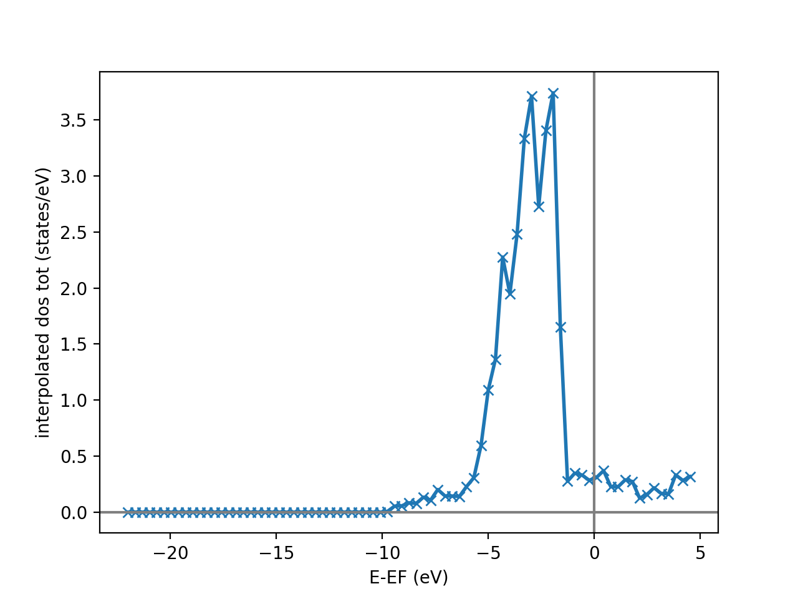
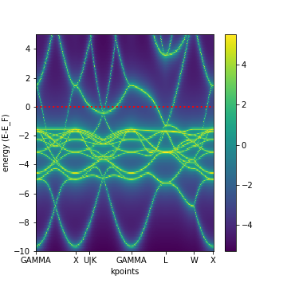

=========
Workflows
=========

This page can contain a short introduction to the workflows provided by ``aiida-kkr``.

Density of states
+++++++++++++++++

The density of states (DOS) workflow ``kkr_dos_wc`` automatically sets the right parameters in the 
input of a KKR calculation to perform a DOS calculation. The specifics of the DOS 
energy contour are set via the ``wf_parameters`` input node which contains default values
if no user input is given.

.. note::
    The default values of the ``wf_parameters`` input node can be extraced using 
    ``kkr_dos_wc.get_wf_defaults()``.

Inputs:
    * ``kkr`` (*aiida.orm.Code*): KKRcode using the ``kkr.kkr`` plugin
    * ``remote_data`` (*RemoteData*): The remote folder of the (converged) calculation whose output potential is used as input for the DOS run
    * ``wf_parameters`` (*ParameterData*, optional): Some settings of the workflow behavior (e.g. number of energy points in DOS contour etc.)
    * ``options`` (*ParameterData*, optional): Some settings for the computer you want to use (e.g. `queue_name`, `use_mpi`, `resources`, ...)
    * ``label`` (*str*, optional): Label of the workflow
    * ``description`` (*str*, optional): Longer description of the workflow
    
Returns nodes:
    * ``dos_data`` (*XyData*): The DOS data on the DOS energy contour (i.e. at some finite temperature)
    * ``dos_data_interpol`` (*XyData*): The interpolated DOS from the line parallel to the real axis down onto the real axis
    * ``results_wf`` (*ParameterData*): The output node of the workflow containing some information on the DOS run

.. note::   
    The *x* and *y* arrays of the ``dos_data`` output nodes can easily be accessed using::
    
        x = dos_data_node.get_x()
        y = dos_data_node.get_y()
    
    where the returned list is of the form ``[label, numpy-array-of-data, unit]`` and the 
    *y*-array contains entries for total DOS, s-, p-, d-, ..., and non-spherical contributions to the DOS, e.g.::
        
        [(u'interpolated dos tot', array([[...]]), u'states/eV'),
         (u'interpolated dos s', array([[...]]), u'states/eV'),
         (u'interpolated dos p', array([[...]]), u'states/eV'),
         (u'interpolated dos d', array([[...]]), u'states/eV'),
         (u'interpolated dos ns', array([[...]]), u'states/eV')]
                                        
    Note that the output data are 2D arrays containing the atom resolved DOS, i.e. the DOS values for all atoms in the unit cell.
    
                                        
Example Usage
-------------

We start by getting an installation of the KKRcode::

    from aiida.orm import Code
    kkrcode = Code.get_from_string('KKRcode@my_mac')
    
Next load the remote folder node of the previous calculation 
(here the :ref:`converged calculation of the Cu bulk test case <KKR_KKR_scf>`) 
from which we want to start the following DOS calculation::

    # import old KKR remote folder
    from aiida.orm import load_node
    kkr_remote_folder = load_node(22852).out.remote_folder
    
Then we set some settings of the workflow parameters (this step is optional)::

    # create workflow settings
    from aiida.orm import DataFactory
    ParameterData = DataFactory('parameter')
    workflow_settings = ParameterData(dict={'dos_params':{'emax': 1, 'tempr': 200, 'emin': -1,
                                                          'kmesh': [20, 20, 20], 'nepts': 81}})
    
Finally we run the workflow::

    from aiida_kkr.workflows.dos import kkr_dos_wc
    from aiida.work import run
    run(kkr_dos_wc, _label='test_doscal', _description='My test dos calculation.', 
        kkr=kkrcode, remote_data=kkr_remote_folder, wf_parameters=workflow_settings)
    
The following script can be used to plot the total interpolated DOS (in the 
``dos_data_interpol`` output node that can for example be access using 
``dos_data_interpol = <kkr_dos_wc-node>.out.dos_data_interpol`` where 
``<kkr_dos_wc-node>`` is the workflow node) of the calculation above::

    def plot_dos(dos_data_node):
        x = dos_data_node.get_x()
        y_all = dos_data_node.get_y()
        
        from matplotlib.pylab import figure, xlabel, ylabel, axhline, axvline, plot, legend, title
        
        figure()
        
        # loop over contributions (tot, s, p, d, ns)
        for y in y_all:
            if y==y_all[0]: # special line formatting for total DOS
                style = 'x-'
                lw = 3
            else:
                style = '--'
                lw = 2
            plot(x[1][0], y[1][0], style, lw=lw, ms=6, label=y[0].split('dos ')[1])
        
        # add axis labels etc                                
        xlabel(x[0]+' ({})'.format(x[-1]))                   
        ylabel(y[0].replace(' ns','')+' ({})'.format(y[-1]))
        axhline(0, color='grey', linestyle='dotted', zorder=-100)
        axvline(0, color='grey', linestyle='dotted', zorder=-100)
        legend(loc=2)
        title('DOS of bulk Cu')
    
    plot_dos(dos_data_interpol)
    
which will produce the following plot:

Bandstructure
+++++++++++++

The bandstructure calculation, using workchain ``kkr_bs_wc``, yields the band structure in terms of the Bloch spectral function. To run the bandstructure calculation all the requried parameters are taken from the parent (converved) KkrCalculation and user-defined ``wf_parameters``.

.. note::   
    Use ``kkr_bs_wc.get_wf_defaults()`` to get the default values for the ``wf_parameters`` input.

Inputs:

    * ``wf_parameters`` (Dict, optional): Workchain Specifications, contains ``nepts`` (int), ``tempr`` (float), ``emin`` (eV), ``emax`` (eV), ``rclustz`` (float, in units of the lattice constant). The energy range given by ``emin`` and ``emax`` are given relative to the Fermi level.

    * ``options`` (Dict, optional): Computer Specifications, schedualer command, parallelization, walltime etc.

    * ``kpoints`` (KpointsData, optional): k-point path used in the bandstructure calculation. If it is not given it is extructed from the structure. (Although it is important the k-points should come from the primitive structure, internally it will be consider in the next version.)

    * ``remote_data`` (RemoteData, mendaory): Parent folder of a converged KkrCalculation.

    * ``kkr`` (Code, mendaory): KKRhost code (i.e. using ``kkr.kkr`` plugin).

    * ``label`` (Str, optional): label for the bandstructure WorkChainNode. Can also be found in the ``result_wf`` output Dict as ``BS_wf_label`` key.

    * ``description`` (Str, optional) : description for the bandstructure WorkChainNode. Can be found in the ``result_wf`` output Dict as ``BS_wf_description`` key

Returns nodes:
    * ``BS_Data`` (ArrayData): Consist of (BlochSpectralFunction, numpy array), (k_points, numpy array), (energy_points, numpy array), (special_kpoints, dict)

    * ``result_wf`` (Dict): work_chain_specifications (such as ‘ *successful* ’, ‘ *list_of_errors* ’, ‘ *BS_params* ’ etc) node , *BS_data* (‘ *BlochSpectralFunction* ’,‘ *Kpts* ’,‘ *energy_points* ’, ' *k-labels* ’ ) node.

Access To Data:
---------------

To access into the data

::

   BS_Data = <WC_NODE>.outputs.BS_Data
   bsf = BS_Data.get_array('BlochSpectralFunction')
   kpts = BS_Data.get_array('Kpts')
   eng_pts = BS_Data.get_array('energy_points')
   k_label= BS_Data.extras['k-labels']

The ``bsf`` array is a 2d-numpy array and contains the Bloch spectral function (k and energy resolved density) and ``k_label`` give the python dict archiving the high-symmetry points, ``index:label``, in kpts.

Example Usage:
^^^^^^^^^^^^^^

To start the Band Structure calculation the steps:

::

   from aiida.orm import load_node, Str, Code, Dict

   # setup the code and computer
   kkrcode = Code.get_from_string('KKRcode@COMPUTERNAME')

   # import the remote folder from the old converged kkr calculation
   kkr_remote_folder = load_node(<KKR_CALC_JOB_NODE_ID>).outputs.remote_folder
    
   # create workflow parameter settings
   workflow_parameters = Dict(dict={'emax': 5, # in eV, relative to EF
                                    'tempr': 50.0, # in K
                                    'emin': -10, # in eV
                                    'rclustz' : 2.3, # alat units
                                    'nepts': 6})

   # Computer configuration
   metadata_option_1 = Dict(dict={
       'max_wallclock_seconds': 36000,
       'resources': {'tot_num_mpiprocs': 48, 'num_machines': 1},
       'custom_scheduler_commands':
       '#SBATCH --account=jara0191\n\nulimit -s unlimited; export OMP_STACKSIZE=2g',
       'withmpi': True})

   label = Str('testing_the_kkr_bs_wc') 

   inputs = {'wf_parameters':workflow_parameters,'options':metadata_option_1,'remote_data':kkr_remote_folder,'kkr':kkrcode,'label':label}

   from aiida_kkr.workflows.bs import kkr_bs_wc
   from aiida.engine import run
   run(kkr_bs_wc, **inputs)

To plot :
^^^^^^^^^

To plot one or more kkr_bs_wc node.

::

   from aiida import load_profile
   load_profile()
   NODE =  <singel or list of nodes>
   from aiida_kkr.tools import plot_kkr
   plot_kkr( NODE, strucplot=False, logscale=True, silent=True, noshow=True) 

For bulk Cu this results in a plot like this:

Generate KKR start potential
++++++++++++++++++++++++++++

Workflow: ``kkr_startpot_wc``

Inputs:
    * ``structure`` (*StructureData*): 
    * ``voronoi`` (*Code*): 
    * ``kkr`` (*Code*): 
    * ``wf_parameters`` (*ParameterData*, optional): 
    * ``options`` (*ParameterData*, optional): Some settings for the computer you want to use (e.g. `queue_name`, `use_mpi`, `resources`, ...)
    * ``calc_parameters`` (*ParameterData*, optional): 
    * ``label`` (*str*, optional): 
    * ``description`` (*str*, optional): 
    
.. note::
    The default values of the ``wf_parameters`` input node can be extraced using 
    ``kkr_dos_wc.get_wf_defaults()`` and it should contain the following entries:
    
    General settings:
        * ``r_cls`` (*float*): 
        * ``natom_in_cls_min`` (*int*): 
        * ``fac_cls_increase`` (*float*): 
        * ``num_rerun`` (*int*): 
        
    Computer settings:
        * ``walltime_sec`` (*int*): 
        * ``custom_scheduler_commands`` (*str*): 
        * ``use_mpi`` (*bool*): 
        * ``queue_name`` (*str*): 
        * ``resources`` (*dict*): ``{'num_machines': 1}``
        
    Settings for DOS check of starting potential:
        * ``check_dos`` (*bool*): 
        * ``threshold_dos_zero`` (*float*): 
        * ``delta_e_min`` (*float*): 
        * ``delta_e_min_core_states`` (*float*): 
        * ``dos_params`` (*dict*): with the keys
            * ``emax`` (*float*): 
            * ``tempr`` (*float*): 
            * ``emin`` (*float*): 
            * ``kmesh`` ([*int*, *int*, *int*]): 
            * ``nepts`` (*int*): 

Output nodes:
    * ``last_doscal_dosdata`` (*XyData*): 
    * ``last_doscal_dosdata_interpol`` (*XyData*): 
    * ``last_doscal_results`` (*ParameterData*): 
    * ``last_params_voronoi`` (*ParameterData*): 
    * ``last_voronoi_remote`` (*RemoteData*): 
    * ``last_voronoi_results`` (*ParameterData*): 
    * ``results_vorostart_wc`` (*ParameterData*): 

                          
Example Usage
-------------

First load KKRcode and Voronoi codes::

    from aiida.orm import Code
    kkrcode = Code.get_from_string('KKRcode@my_mac')
    vorocode = Code.get_from_string('voronoi@my_mac')
    
Then choose some settings for the KKR specific parameters (LMAX cutoff etc.)::

    from aiida_kkr.tools.kkr_params import kkrparams
    kkr_settings = kkrparams(NSPIN=1, LMAX=2)
    
Now we create a structure node for the system we want to calculate::

    # create Copper bulk aiida Structure
    from aiida.orm import DataFactory
    StructureData = DataFactory('structure')
    alat = 3.61 # lattice constant in Angstroem
    bravais = alat*array([[0.5, 0.5, 0], [0.5, 0, 0.5], [0, 0.5, 0.5]]) # Bravais matrix in Ang. units
    Cu = StructureData(cell=bravais)
    Cu.append_atom(position=[0,0,0], symbols='Cu')
    
Finally we run the ``kkr_startpot_wc`` workflow (here using the defaults for the workflow settings)::

    from aiida_kkr.workflows.voro_start import kkr_startpot_wc
    from aiida.work import run
    ParameterData = DataFactory('parameter')
    run(kkr_startpot_wc, structure=Cu, voronoi=vorocode, kkr=kkrcode, calc_parameters=ParameterData(dict=kkr_settings.get_dict()))

    

KKR scf cycle
+++++++++++++

Workflow: ``kkr_scf_wc``

Inputs:

::

    {'strmix': 0.03, 'brymix': 0.05, 'init_pos': None, 'convergence_criterion': 1e-08, 
     'custom_scheduler_commands': '', 'convergence_setting_coarse': {'npol': 7, 'tempr': 1000.0, 
                                                                     'n1': 3, 'n2': 11, 'n3': 3, 
                                                                     'kmesh': [10, 10, 10]}, 
     'mixreduce': 0.5, 'mag_init': False, 'retreive_dos_data_scf_run': False, 
     'dos_params': {'emax': 0.6, 'tempr': 200, 'nepts': 81, 'kmesh': [40, 40, 40], 'emin': -1}, 
     'hfield': 0.02, 'queue_name': '', 'threshold_aggressive_mixing': 0.008, 
     'convergence_setting_fine': {'npol': 5, 'tempr': 600.0, 'n1': 7, 'n2': 29, 'n3': 7, 
                                  'kmesh': [30, 30, 30]}, 
     'use_mpi': False, 'nsteps': 50, 'resources': {'num_machines': 1}, 'delta_e_min': 1.0, 
     'walltime_sec': 3600, 'check_dos': True, 'threshold_switch_high_accuracy': 0.001, 
     'kkr_runmax': 5, 'threshold_dos_zero': 0.001}

    _WorkChainSpecInputs({'_label': None, '_description': None, '_store_provenance': True, 
                          'dynamic': None, 'calc_parameters': None, 'kkr': None, 'voronoi': None, 
                          'remote_data': None, 'wf_parameters': <ParameterData: uuid: b132dfc4-3b7c-42e7-af27-4083802aff40 (unstored)>, 
                          'structure': None})
    
Outputs:

::

    {'final_dosdata_interpol': <XyData: uuid: 0c14146d-90aa-4eb8-834d-74a706e500bb (pk: 22872)>,
     'last_InputParameters': <ParameterData: uuid: 28a277ad-8998-4728-8296-75fd3b0c4eb4 (pk: 22875)>,
     'last_RemoteData': <RemoteData: uuid: d24cdfc1-938a-4308-b273-e0aa8697c975 (pk: 22876)>,
     'last_calc_out': <ParameterData: uuid: 1c8fab2d-e596-4874-9516-c1387bf7db7c (pk: 22874)>,
     'output_kkr_scf_wc_ParameterResults': <ParameterData: uuid: 0f21ac18-e556-49f8-aa26-55260d013fac (pk: 22878)>,
     'results_vorostart': <ParameterData: uuid: 93831550-8775-493a-907b-27a470b52dc8 (pk: 22877)>,
     'starting_dosdata_interpol': <XyData: uuid: 54fa57ad-f559-4837-ba1e-7db4ed67d5b0 (pk: 22873)>}

          
Example Usage
-------------

Case 1: Start from previous calculation
^^^^^^^^^^^^^^^^^^^^^^^^^^^^^^^^^^^^^^^

::

    from aiida.orm import Code
    kkrcode = Code.get_from_string('KKRcode@my_mac')
    vorocode = Code.get_from_string('voronoi@my_mac')
    
::

    from aiida_kkr.tools.kkr_params import kkrparams
    kkr_settings = kkrparams(NSPIN=1, LMAX=2)
    
::
    
    from aiida.orm import load_node
    kkr_startpot = load_node(22586)
    last_vorono_remote = kkr_startpot.get_outputs_dict().get('last_voronoi_remote')
    
::

    from aiida_kkr.workflows.kkr_scf import kkr_scf_wc
    from aiida.work import run
    ParameterData = DataFactory('parameter')
    run(kkr_scf_wc, kkr=kkrcode, calc_parameters=ParameterData(dict=kkr_settings.get_dict()), remote_data=last_vorono_remote)
    

Case 2: Start from structure and run voronoi calculation first 
^^^^^^^^^^^^^^^^^^^^^^^^^^^^^^^^^^^^^^^^^^^^^^^^^^^^^^^^^^^^^^

::

    # create Copper bulk aiida Structure
    fro numpy import array
    from aiida.orm import DataFactory
    StructureData = DataFactory('structure')
    alat = 3.61 # lattice constant in Angstroem
    bravais = alat*array([[0.5, 0.5, 0], [0.5, 0, 0.5], [0, 0.5, 0.5]]) # Bravais matrix in Ang. units
    Cu = StructureData(cell=bravais)
    Cu.append_atom(position=[0,0,0], symbols='Cu')
    
::

    run(kkr_scf_wc, structure=Cu, kkr=kkrcode, voronoi=vorocode, calc_parameters=ParameterData(dict=kkr_settings.get_dict()))
    
    
KKR flex (GF calculation)
+++++++++++++++++++++++++

The Green's function writeout workflow performs a KKR calculation with runoption
``KKRFLEX`` to write out the ``kkr_flexfiles``. Those are needed for a ``kkrimp``
calculation.

Inputs:
    * ``kkr`` (*aiida.orm.Code*): KKRcode using the ``kkr.kkr`` plugin
    * ``remote_data`` (*RemoteData*): The remote folder of the (converged) kkr calculation
    * ``imp_info`` (*ParameterData*): ParameterData node containing the information of the desired impurities (needed to write out the ``kkr_flexfiles`` and the ``scoef`` file)
    * ``options`` (*ParameterData*, optional): Some settings for the computer (e.g. computer settings)
    * ``wf_parameters`` (*ParameterData*, optional): Some settings for the workflow behaviour
    * ``label`` (*str*, optional): Label of the workflow
    * ``description`` (*str*, optional): Longer description of the workflow
    
Returns nodes:
    * ``workflow_info`` (*ParameterData*): Node containing general information about the workflow (e.g. errors, computer information, ...)
    * ``GF_host_remote`` (*RemoteData*): RemoteFolder with all of the ``kkrflexfiles`` and further output of the workflow
    
    
Example Usage
-------------

We start by getting an installation of the KKRcode::

    from aiida.orm import Code
    kkrcode = Code.get_from_string('KKRcode@my_mac')
    
Next load the remote folder node of the previous calculation 
(here the :ref:`converged calculation of the Cu bulk test case <KKR_KKR_scf>`) 
from which we want to start the following KKRFLEX calculation::

    # import old KKR remote folder
    from aiida.orm import load_node
    kkr_remote_folder = load_node(<pid of converged calc>).out.remote_folder
    
Afterwards, the information regarding the impurity has to be given
(in this example, we use a Au impurity with a cutoff radius of 2 alat which is placed in the first labelled lattice point of the unit cell). Further keywords for the ``impurity_info`` node can be found in the respective part of the documentation::
 
     # set up impurity info node
     imps = ParameterData(dict={'ilayer_center':0, 'Rcut':2, 'Zimp':[79.]})
    
Then we set some settings of the options parameters (this step is optional)::

    # create workflow settings
    from aiida.orm import DataFactory
    ParameterData = DataFactory('parameter')
    options = ParameterData(dict={'use_mpi':'false', 'queue_name':'viti_node', 'walltime_sec' : 60*60*2,  
                                            'resources':{'num_machines':1, 'num_mpiprocs_per_machine':1}})
    
Finally we run the workflow::

    from aiida_kkr.workflows.gf_writeout import kkr_flex_wc
    from aiida.work import run
    run(kkr_flex_wc, label='test_gf_writeout', description='My test KKRflex calculation.', 
        kkr=kkrcode, remote_data=kkr_remote_folder, options=options, wf_parameters=wf_params)
        
        
Exchange coupling constants
+++++++++++++++++++++++++++

Calculation of the exchange coupling constants (Jij's and Dij's) can be done with the ``kkr_jij_wc`` workchain starting from the remote folder of a parent calculation.

.. note::   
    Use ``kkr_jij_wc.get_wf_defaults()`` to get the default values for the ``wf_parameters`` input.

Inputs:

    * ``wf_parameters`` (Dict, optional): Workchain settings where the Jij radius in Angstroem units is given (defaults to 5 Ang.). With ``jijsite_i`` and ``jijsite_j`` one can specify to calculate the Jij's only for some pairs i,j.

    * ``options`` (Dict, optional): Computer options (scheduler command, parallelization, walltime etc.)

    * ``remote_data`` (RemoteData, mandatory): Parent folder of a converged KkrCalculation.

    * ``kkr`` (Code, mandatory): KKRhost code (i.e. using ``kkr.kkr`` plugin).
    
    * ``params_kkr_overwrite`` (Dict, optional): Optional set of KKR parameters that overwrite the settings extracted from the parent calculation.

Returns nodes:
    * ``jij_data`` (ArrayData): Jij data with the arrays ``Jij_expanded`` that contains all (i, j, da, db, dc, Jij [, Dij]) pairs and ``positions_expanded`` that contains the corresponding positions (i.e. the offset of j vs i).

    * ``structure_jij_sites`` (StructureData): Structure with the Jij sites that match the mapping in ``jij_data``

Example Usage:
^^^^^^^^^^^^^^

To start the Band Structure calculation the steps:

::

    from aiida_kkr.workflows import kkr_jij_wc
    
    # converged KKR calculation
    kkr_calc_converged = load_node(<PK>)

    # create process builder
    builder = kkr_jij_wc.get_builder()
    
    builder.parent_folder = kkr_calc_converged.outputs.remote_folder
    
    builder.kkr = parent.inputs.code
    builder.options = Dict(dict={...}) # settings for the computer that we use
    
    wfd = kkr_jij_wc.get_wf_defaults()
    wfd['jijrad_ang'] = 5.0 # set at least the Jij cutoff radius in Ang units
    builder.wf_parameters = Dict(dict=wfd)
    
    # maybe overwrite some input parameters
    # here we switch on the SOC mode starting from a no SOC calculation
    builder.params_kkr_overwrite = Dict(dict={
        'NPAN_LOG': 5,
        'NPAN_EQ': 15,
        'NCHEB': 12,
        'R_LOG': 0.6,
        'USE_CHEBYCHEV_SOLVER': True,
        'SET_CHEBY_NOSOC': True
    })
    
    # submit calculation
    jij_wf = submit(builder)

    

KKR impurity self consistency
+++++++++++++++++++++++++++++

This workflow performs a KKRimp self consistency calculation starting from a 
given host-impurity startpotential and converges it.
    
.. note::
    This workflow does only work for a non-magnetic calculation without spin-orbit-coupling. Those
    two features will be added at a later stage. This is also just a sub workflow, meaning that it only 
    converges an already given host-impurity potential. The whole kkrimp workflow starting from scratch
    will also be added at a later stage.
    
Inputs:
    * ``kkrimp`` (*aiida.orm.Code*): KKRimpcode using the ``kkr.kkrimp`` plugin
    * ``host_imp_startpot`` (*SinglefileData*, optional): File containing the host impurity potential (potential file with the whole cluster with all host and impurity potentials)
    * ``remote_data`` (*RemoteData*, optional): Output from a KKRflex calculation (can be extracted from the output of the GF writeout workflow)
    * ``kkrimp_remote`` (*RemoteData*, optional): RemoteData output from previous kkrimp calculation (if given, ``host_imp_startpot`` is not needed as input)
    * ``impurity_info`` (*ParameterData*, optional): Node containing information about the impurity cluster (has to be chosen consistently with ``imp_info`` from GF writeout step)
    * ``options`` (*ParameterData*, optional): Some general settings for the workflow (e.g. computer settings, queue, ...)
    * ``wf_parameters`` (*ParameterData*, optional) : Settings for the behavior of the workflow (e.g. convergence settings, physical properties, ...)
    * ``label`` (*str*, optional): Label of the workflow
    * ``description`` (*str*, optional): Longer description of the workflow
    
Returns nodes:
    * ``workflow_info`` (*ParameterData*): Node containing general information about the workflow (e.g. errors, computer information, ...)
    * ``host_imp_pot`` (*SinglefileData*): Converged host impurity potential that can be used for further calculations (DOS calc, new input for different KKRimp calculation)
    

Example Usage
-------------

We start by getting an installation of the KKRimpcode::

    from aiida.orm import Code
    kkrimpcode = Code.get_from_string('KKRimpcode@my_mac')
    
Next, either load the remote folder node of the previous calculation 
(here the KKRflex calculation that writes out the GF and KKRflexfiles) or the output node
of the  gf_writeout workflow from which we want to start the following KKRimp calculation::

    # import old KKRFLEX remote folder
    from aiida.orm import load_node
    GF_host_output_folder = load_node(<pid of KKRFLEX calc>).out.remote_folder # 1st possibility
    # GF_host_output_folder = load_node(<pid of gf_writeout wf output node>) # 2nd possibility: take ``GF_host_remote`` output node from gf_writeout workflow
    
Now, load a converged calculation of the host system (here Cu bulk) as well as an auxiliary voronoi calculation
(here Au) for the desired impurity::

    # load converged KKRcalc
    kkrcalc_converged = load_node(<pid of converged KKRcalc (Cu bulk)>)
    # load auxiliary voronoi calculation
    voro_calc_aux = load_node(<pid of voronoi calculation for the impurity (Au)>)

Using those, one can obtain the needed host-impurity potential that is needed as input for the workflow. Therefore,
we use the ``neworder_potential_wf`` workfunction which is able to generate the startpot::

    ## load the neccessary function
    from aiida_kkr.tools.common_workfunctions import neworder_potential_wf
    import numpy as np

    # extract the name of the converged host potential
    potname_converged = kkrcalc_converged._POTENTIAL
    # set the name for the potential of the desired impurity (here Au)
    potname_imp = 'potential_imp'
    
    neworder_pot1 = [int(i) for i in np.loadtxt(GF_host_calc.out.retrieved.get_abs_path('scoef'), skiprows=1)[:,3]-1]
    potname_impvorostart = voro_calc_aux._OUT_POTENTIAL_voronoi
    replacelist_pot2 = [[0,0]]

    # set up settings node to use as argument for the neworder_potential function
    settings_dict = {'pot1': potname_converged,  'out_pot': potname_imp, 'neworder': neworder_pot1,
                     'pot2': potname_impvorostart, 'replace_newpos': replacelist_pot2, 'label': 'startpot_KKRimp',
                     'description': 'starting potential for Au impurity in bulk Cu'}
    settings = ParameterData(dict=settings_dict)

    # finally create the host-impurity potential (here ``startpot_Au_imp_sfd``) using the settings node as well as
    the previously loaded converged KKR calculation and auxiliary voronoi calculation:
    startpot_Au_imp_sfd = neworder_potential_wf(settings_node=settings,
                                                parent_calc_folder=kkrcalc_converged.out.remote_folder,
                                                parent_calc_folder2=voro_calc_aux.out.remote_folder)
    
.. note ::
    Further information how the neworder potential function works can be found in the respective part of
    this documentation.
    
    
Afterwards, the information regarding the impurity has to be given
(in this example, we use a Au impurity with a cutoff radius of 2 alat which is placed in the first labelled lattice point of the unit cell). Further 
keywords for the ``impurity_info`` node can be found in the respective part of the documentation::
 
     # set up impurity info node
     imps = ParameterData(dict={'ilayer_center':0, 'Rcut':2, 'Zimp':[79.]})
    
Then, we set some settings of the options parameters on the one hand and specific wf_parameters
regarding the convergence etc.::

    options = ParameterData(dict={'use_mpi':'false', 'queue_name':'viti_node', 'walltime_sec' : 60*60*2,  
                                  'resources':{'num_machines':1, 'num_mpiprocs_per_machine':20}})
    kkrimp_params = ParameterData(dict={'nsteps': 50, 'convergence_criterion': 1*10**-8, 'strmix': 0.1, 
                                        'threshold_aggressive_mixing': 3*10**-2, 'aggressive_mix': 3,
                                         'aggrmix': 0.1, 'kkr_runmax': 5})
    
Finally we run the workflow::

    from aiida_kkr.workflows.kkr_imp_sub import kkr_imp_sub_wc
    from aiida.work import run
    run(kkr_imp_sub_wc, label='kkr_imp_sub test (CuAu)', description='test of the kkr_imp_sub workflow for Cu, Au system',
        kkrimp=kkrimpcode, options=options, host_imp_startpot=startpot_Au_imp_sfd, 
        remote_data=GF_host_output_folder, wf_parameters=kkrimp_params)
    
    
KKR impurity workflow
+++++++++++++++++++++

This workflow performs a KKR impurity calculation starting from an ``impurity_info`` node
as well as either from a coverged calculation remote for the host system (1) or from a
GF writeout remote (2). In the two cases the following is done:

    * (1): First, the host system will be converged using the ``kkr_scf`` workflow. Then, the GF will be calculated using the ``gf_writeout`` workflow before calculating the auxiliary startpotential of the impurity. Now, the total impurity-host startpotential will be generated and then converged using the ``kkr_imp_sub`` workflow.
    * (2): In this case the two first steps from above will be skipped and the workflow starts by calculating the auxiliary startpotential.
           
.. note::
    This workflow is different from the ``kkr_imp_sub`` workflow that only converges a given
    impurity host potential. Here, the whole process of a KKR impurity calculation is done
    automatically.
    
Inputs:
    * ``kkrimp`` (*aiida.orm.Code*): KKRimpcode using the ``kkr.kkrimp`` plugin
    * ``voronoi`` (*aiida.orm.Code*): Voronoi code using the ``kkr.voro`` plugin
    * ``kkr`` (*aiida.orm.Code*): KKRhost code using the ``kkr.kkr`` plugin
    * ``impurity_info`` (*ParameterData*): Node containing information about the impurity cluster
    * ``remote_data_host`` (*RemoteData*, optional): RemoteData of a converged host calculation if you want to start the workflow from scratch
    * ``remote_data_gf`` (*RemoteData*, optional): RemoteData of a GF writeout step (if you want to skip the convergence of the host and the GF writeout step)
    * ``options`` (*ParameterData*, optional): Some general settings for the workflow (e.g. computer settings, queue, ...)
    * ``wf_parameters`` (*ParameterData*, optional) : Settings for the behavior of the workflow (e.g. convergence settings, physical properties, ...)
    * ``voro_aux_parameters`` (*ParameterData*, optional): Settings for the usage of the ``kkr_startpot`` sub workflow needed for the auxiliary voronoi potentials
    * ``label`` (*str*, optional): Label of the workflow
    * ``description`` (*str*, optional): Longer description of the workflow    
    
Returns nodes:
    * ``workflow_info`` (*ParameterData*): Node containing general information about the workflow
    * ``last_calc_info`` (*ParameterData*): Node containing information about the last used calculation of the workflow
    * ``last_calc_output_parameters`` (*ParameterData*): Node with all of the output parameters from the last calculation of the workflow
    
    
Example Usage
-------------

We start by getting an installation of the codes::

    from aiida.orm import Code
    kkrimpcode = Code.get_from_string('KKRimpcode@my_mac')
    kkrcode = Code.get_from_string('KKRcode@my_mac')
    vorocode = Code.get_from_string('vorocode@my_mac')
    
Then, set up an appropriate ``impurity_info`` node for your calculation::

     # set up impurity info node
     imps = ParameterData(dict={'ilayer_center':0, 'Rcut':2, 'Zimp':[79.]})    
    
Next, load either a ``gf_writeout_remote`` or a ``converged_host_remote``::

    from aiida.orm import load_node
    gf_writeout_remote = load_node(<pid or uuid>)
    converged_host_remote = load_node(<pid or uuid>)
    
Set up some more input parameter nodes for your workflow::

    # node for general workflow options
    options = ParameterData(dict={'use_mpi': False, 'walltime_sec' : 60*60*2,  
                                  'resources':{'num_machines':1, 'num_mpiprocs_per_machine':1}})
    # node for convergence behaviour of the workflow
    kkrimp_params = ParameterData(dict={'nsteps': 99, 'convergence_criterion': 1*10**-8, 'strmix': 0.02, 
                                        'threshold_aggressive_mixing': 8*10**-2, 'aggressive_mix': 3,
                                        'aggrmix': 0.04, 'kkr_runmax': 5, 'calc_orbmom': False, 'spinorbit': False,
                                        'newsol': False, 'mag_init': False, 'hfield': [0.05, 10],
                                        'non_spherical': 1, 'nspin': 2})
    # node for parameters needed for the auxiliary voronoi workflow
    voro_aux_params = ParameterData(dict={'num_rerun' : 4, 'fac_cls_increase' : 1.5, 'check_dos': False, 
                                          'lmax': 3, 'gmax': 65., 'rmax': 7., 'rclustz': 2.})
    
Finally, we run the workflow (for the two cases depicted above)::

    from aiida_kkr.workflows.kkr_scf import kkr_scf_wc
    from aiida_kkr.workflows.voro_start import kkr_startpot_wc
    from aiida_kkr.workflows.kkr_imp_sub import kkr_imp_sub_wc
    from aiida_kkr.workflows.gf_writeout import kkr_flex_wc
    from aiida_kkr.workflows.kkr_imp import kkr_imp_wc
    from aiida.work.launch import run, submit
    
    # don't forget to set a label and description for your workflow
    
    # case (1)
    wf_run = submit(kkr_imp_wc, label=label, description=description, voronoi=vorocode, kkrimp=kkrimpcode, 
                    kkr=kkrcode, options=options, impurity_info=imps, wf_parameters=kkrimp_params, 
                    voro_aux_parameters=voro_aux_params, remote_data_gf=gf_writeout_remote)
    
    # case (2)
    wf_run = submit(kkr_imp_wc, label=label, description=description, voronoi=vorocode, kkrimp=kkrimpcode, 
                    kkr=kkrcode, options=options, impurity_info=imps, wf_parameters=kkrimp_params, 
                    voro_aux_parameters=voro_aux_params, remote_data_host=converged_host_remote)    
    
    
KKR impurity density of states
++++++++++++++++++++++++++++++

This workflow calculates the density of states for a given host impurity input potential.

Inputs:
    * ``kkrimp`` (*aiida.orm.Code*): KKRimpcode using the ``kkr.kkrimp`` plugin
    * ``kkr`` (*aiida.orm.Code*): KKRhost code using the ``kkr.kkr`` plugin
    * ``host_imp_pot`` (*SinglefileData*): converged host impurity potential from impurity workflow
    * ``options`` (*ParameterData*, optional): Some general settings for the workflow (e.g. computer settings, queue, ...)
    * ``wf_parameters`` (*ParameterData*, optional) : Settings for the behavior of the workflow (e.g. convergence settings, physical properties, ...)
    * ``label`` (*str*, optional): Label of the workflow
    * ``description`` (*str*, optional): Longer description of the workflow    
    
Returns nodes:
    * ``workflow_info`` (*ParameterData*): Node containing general information about the workflow
    * ``last_calc_info`` (*ParameterData*): Node containing information about the last used calculation of the workflow
    * ``last_calc_output_parameters`` (*ParameterData*): Node with all of the output parameters from the last calculation of the workflow
    
Example Usage
-------------

We start by getting an installation of the codes::

    from aiida.orm import Code
    kkrimpcode = Code.get_from_string('KKRimpcode@my_mac')
    vorocode = Code.get_from_string('vorocode@my_mac')    
    
Next, load the converged host impurity potential::

    from aiida.orm import load_node
    startpot = load_node(<pid or uuid of SinglefileData>)
    
Set up some more input parameter nodes for your workflow::

    # node for general workflow options
    options = ParameterData(dict={'use_mpi': False, 'walltime_sec' : 60*60*2,  
                                  'resources':{'num_machines':1, 'num_mpiprocs_per_machine':1}})
    # node for convergence behaviour of the workflow
    wf_params = ParameterData(dict={'ef_shift': 0. ,
                                    'dos_params': {'nepts': 61,
                                                   'tempr': 200,
                                                   'emin': -1,
                                                   'emax': 1,
                                                   'kmesh': [30, 30, 30]},
                                    'non_spherical': 1, 
                                    'born_iter': 2,
                                    'init_pos' : None, 
                                    'newsol' : False})
    
Finally, we run the workflow (for the two cases depicted above)::

    from aiida_kkr.workflows.kkr_imp_dos import kkr_imp_dos_wc
    from aiida.work.launch import run, submit
    
    # don't forget to set a label and description for your workflow
    wf_run = submit(kkr_imp_dos_wc, label=label, description=description, kkrimp=kkrimpcode, 
                    kkrcode=kkrcode, options=options, wf_parameters=wf_params) 

Equation of states
++++++++++++++++++

Workflow: ``aiida_kkr.workflows.eos``

.. warning:: Not documented yet!

Check KKR parameter convergence
+++++++++++++++++++++++++++++++

Workflow: ``aiida_kkr.workflows.check_para_convergence``

.. warning:: Not implemented yet!

Idea is to run checks after convergence for the following parameters:
    * RMAX
    * GMAX
    * cluster radius
    * energy contour
    * kmesh 
   

Find magnetic ground state
++++++++++++++++++++++++++

Workflow: ``aiida_kkr.workflows.check_magnetic_state``

.. warning:: Not implemented yet!

The idea is to run a Jij calculation to estimate if the ferromagnetic state is 
the ground state or not. Then the unit cell could be doubled to compute the 
antiferromagnetic state. In case of noncollinear magnetism the full Jij tensor 
should be analyzed.

